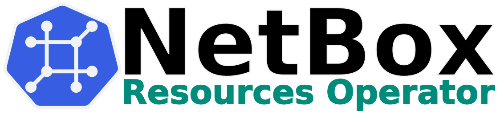
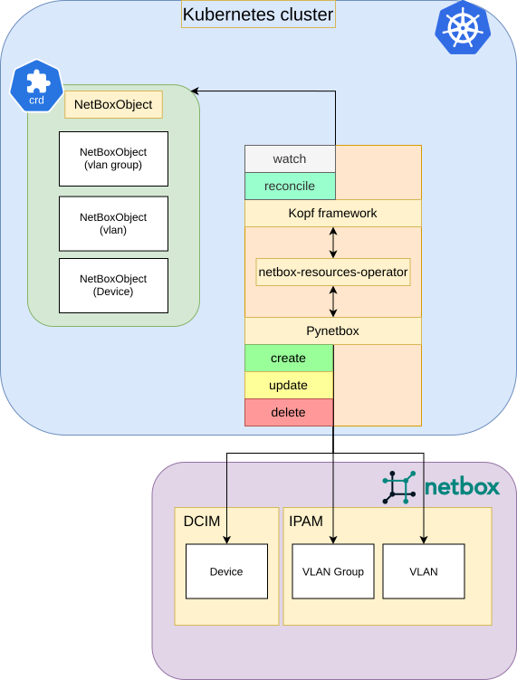

# NetBox Resources Operator

NetBox Resources Operator is a thin wrapper over [NetBox REST API](https://netboxlabs.com/docs/netbox/integrations/rest-api/) ([Pynetbox](https://github.com/netbox-community/pynetbox) in particular) with a few helper utilities providing an interface for creating NetBox objects using Kubernetes custom resources.

## 💡 Motivation

Kubernetes is a container orchestration tool that is now used for everything infrastructure-related, from running simple container apps to provisioning and managing whole clusters, including their network and hardware.

NetBox is a network source of truth tool that allows modeling and documenting modern networks.

To populate NetBox with real world data in an efficient manner, teams can use its REST API. A good amount of tools have been built around it including programming language libraries (e.g., for Go and Python), Ansible modules, Terraform providers, etc.

Using Kubernetes custom resources to document network and infrastructure has multiple benefits:
- Reconciliation. Normally, when automating the object creation, one needs to define the order they are created in to ensure the correct execution. Kubernetes operators reconcile continuously after errors until the desired state is reached
- Teams may provision bare-metal or virtual machines using tools like Metal³, Tinkerbell, KubeVirt, etc. By using the operator, they can create corresponding infrastructure in NetBox right along the deployment manifests
- Fewer tools and management overhead. If teams already manage most of their infrastructure using Helm, they won't need to add other tools to create NetBox objects

These and other use cases are covered by this operator.

## 🛳️ Deployment

The easiest way to deploy the operator is using the Helm chart.

```bash
helm repo add nccloud https://nccloud.github.io/charts
helm install netbox-resources-operator nccloud/netbox-resources-operator --set operatorConfig.netboxUrl="https://your-netbox-host" --set operatorConfig.netboxTokenSecretName="your-k8s-secret-with-read-write-netbox-token"
```

## ⚒️ Usage

Every NetBox object is created using the `NetBoxObject` Kubernetes CRD. Below is a bare minimum example of such an object:

```yaml
apiVersion: spaceship.com/v1alpha1
kind: NetBoxObject
metadata:
  name: test-ip-address
spec:
  dataModel: "ipam"
  endpoint: "ip_addresses"
  allowExisting: true # the operator will manage existing objects
  preserveOnDelete: false # delete from NetBox on CR delete
  body:
    - path: "address"
      value: "10.0.0.1/24"
      lookupKey: True # use this path with the value for existing object lookup before creation
    - path: "status"
      value: "active"
```

Please check the [examples](examples) folder for more details on how to provision NetBox objects.

## 🧱 Architecture



## ⚙️ How It Works

The goal of the operator is to construct a valid NetBox API request based on the data from the `NetBoxObject` custom resource and send it using [Pynetbox](https://github.com/netbox-community/pynetbox).

With this approach, it's possible to create almost any object without a strict CRD API schema. However, the caveat is that the user should adhere and be familiar with [NetBox REST API](https://netboxlabs.com/docs/netbox/integrations/rest-api/).

### Object and Field Ownership

By default, the operator will only manage new NetBox objects.

However, if migrating from a different tool, etc., it's possible to configure the operator to start managing existing objects on a per-resource basis.

Besides, the operator only manages object paths specified inside the CR and will perform the `PATCH` operation on the NetBox object. Therefore, custom changes to other paths will not be overridden during reconciliation.

### Object Lookup

The operator supports treating object paths as lookup filters to find existing objects. Since NetBox supports only a handful of filters per model, it is user's responsibility to configure what fields should be used for the search.

Additionally, some fields have different names for creation/update and filtering, e.g. `tags` for creation and `tag` for filtering.

Please refer to the [examples](examples) and CRD documentation for more details.

### Referencing Existing Objects

When creating a NetBox object, it's often necessary to specify foreign keys of other NetBox models. For example, when creating a VLAN in a VLAN group.

To address this, the operator supports NetBox object referencing based on different filters.

Please check the [examples](examples) folder for more details.

### Available Resource Allocation

Certain NetBox models such as IP ranges, Prefixes, and VLAN groups allow allocating available resources.

The operator supports this functionality and extends it with a special global VLAN allocation in a group.

Please check the [examples](examples) folder for more details.

## ✨ Features

Below is a list of implemented and yet-to-be-implemented features
- [x] CRUD operations on any NetBox data model
- [x] Field resolution to get data from other NetBox objects
- [x] Tag auto-conversion to IDs and creation if missing
- [x] Allocation of available resources in parent objects (prefixes, IP ranges, VLAN groups, ungrouped VLANs)
- [ ] Periodic reconciliation of existing objects to make sure the NetBox object matches the Kubernetes manifest
- [x] Prometheus metrics
- [ ] Improved diffing logic in Pynetbox to avoid sending unnecessary patch requests
- [x] Unit tests
- [ ] Integration tests

## 🚧 Limitations
- The operator reconciliation loop is built using the [Kopf](https://github.com/nolar/kopf) framework. Therefore, it differs from more popular frameworks like [Kubebuilder](https://github.com/kubernetes-sigs/kubebuilder) and may not provide all the features you are used to when using Go-based operator frameworks
- The creation of NetBox plugin objects is currently not supported. Please let us know if you need this functionality

## 🏷️ Versioning

We use [SemVer](http://semver.org/) for versioning.
To see the available versions, check the [tags on this repository](https://github.com/NCCloud/netbox-resources-operator/tags).

## 🤝 Contribution

We welcome contributions, issues, and feature requests!<br />
If you have any issues or suggestions, please feel free to check the [issues page](https://github.com/NCCloud/netbox-resources-operator/issues) or create a new issue if you don't see one that matches your problem. <br>
Please refer to our [contribution guidelines](CONTRIBUTING.md) for details.

## 📝 License
All functionality is in beta and is subject to change. The code is provided as-is with no warranties.<br>
[Apache 2.0 License](./LICENSE)<br>
<br><br>
<br>
Made with <span style="color: #e25555;">&hearts;</span> by [Namecheap Cloud Team](https://github.com/NCCloud)
